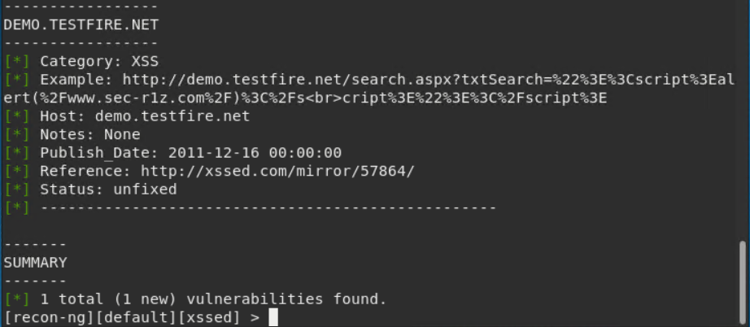

## Week 16 Homework Submission File: Penetration Testing 1

#### Step 1: Google Dorking

- Using Google, can you identify who the Chief Executive Officer of Altoro Mutual is: Karl Fitzgerald

- How can this information be helpful to an attacker: An attacker can use this information to formulate a social engineering campaign.

#### Step 2: DNS and Domain Discovery

Enter the IP address for `demo.testfire.net` into Domain Dossier and answer the following questions based on the results:

  1. Where is the company located: 9725 Datapoint Drive, Suite 100, San Antonio, TX, 78229, US.

  2. What is the NetRange IP address: 65.61.137.64 - 65.61.137.127

  3. What is the company they use to store their infrastructure: Rackspace, com

  4. What is the IP address of the DNS server: 65.61.137.117

#### Step 3: Shodan

- What open ports and running services did Shodan find:
  * 80, 443, 8080
  * 80, tcp, http

#### Step 4: Recon-ng

- Install the Recon module `xssed`. 
- Set the source to `demo.testfire.net`. 
- Run the module. 

Is Altoro Mutual vulnerable to XSS: Yes, (1) Vulnerability found.

### Step 5: Zenmap

Your client has asked that you help identify any vulnerabilities with their file-sharing server. Using the Metasploitable machine to act as your client's server, complete the following:

- Command for Zenmap to run a service scan against the Metasploitable machine: `nmap-T4-F --script ftp-vsftpd-backdoor 192.168.0.10`
 
- Bonus command to output results into a new text file named `zenmapscan.txt`:

- Zenmap vulnerability script command: `nmap-T4-F --script ftp-vsftpd-backdoor  192.168.0.10`

- Once you have identified this vulnerability, answer the following questions for your client:
  1. What is the vulnerability: port 21 VULNERABLE (Exploitable)

  2. Why is it dangerous: It is dangerous because attacker exploit the server through backdoor attack.

  3. What mitigation strategies can you recommendations for the client to protect their server: By closing the port.
     
---
